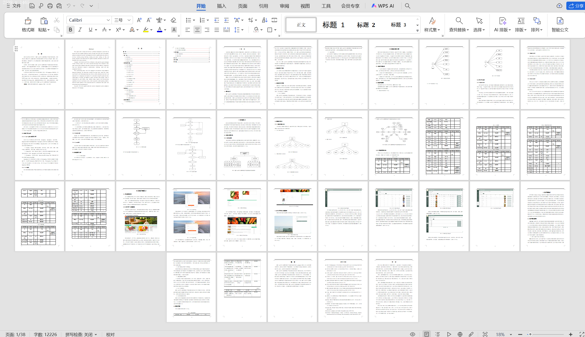

# springbootA420
springbootA420可追溯果蔬生产过程的管理系统+LW
 
## 查看主页获取源码

### 一、关键词

果蔬生产溯源管理系统，智慧农业果蔬追溯管理系统，农产品（果蔬）追溯管理平台
 

### 二、作品包含

源码+数据库+设计文档万字+全套环境和工具资源+部署教程

 

### 三、项目技术

前端技术：Html、Css、Js、Vue2.0、Element-ui 
后端技术：Java、SpringBoot2.0、MyBatis

  

 

### 四、运行环境（以下版本亲测，其他版本未知，请自测）

开发工具：IDEA/eclipse  + VSCODE

数据库：MySQL5.7（最低要5.7版本）

数据库管理工具：Navicat10以上版本

环境配置软件： JDK1.8 + Maven3.6.3

前端Nodejs：14

浏览器：谷歌浏览器

 

### 五、项目介绍

项目编号：springbootA420

通过该系统，果蔬生产企业能够实时记录和管理果蔬的生产过程，包括播种、施肥、浇水、病虫害防治、采摘等环节，并为消费者提供可信赖的果蔬追溯信息，实现从源头到终端的全程可追溯。
系统设计主要采用的是JAVA语言来进行开发，采用springboot框架技术，框架分为三层，分别是控制层Controller，业务处理层Service，持久层dao，能够采用多层次管理开发，对于各个模块设计制作有一定的安全性；数据库方面主要采用的是MySQL来进行开发，其特点是稳定性好，数据库存储容量大，处理能力快等优势；服务器采用的是Tomcat服务，能够提供稳固的运行平台，确保系统稳定运行，提供了一个多样功能，具有良好实用性的基于web的可追溯果蔬生产过程管理系统。 
### 六、运行截图

